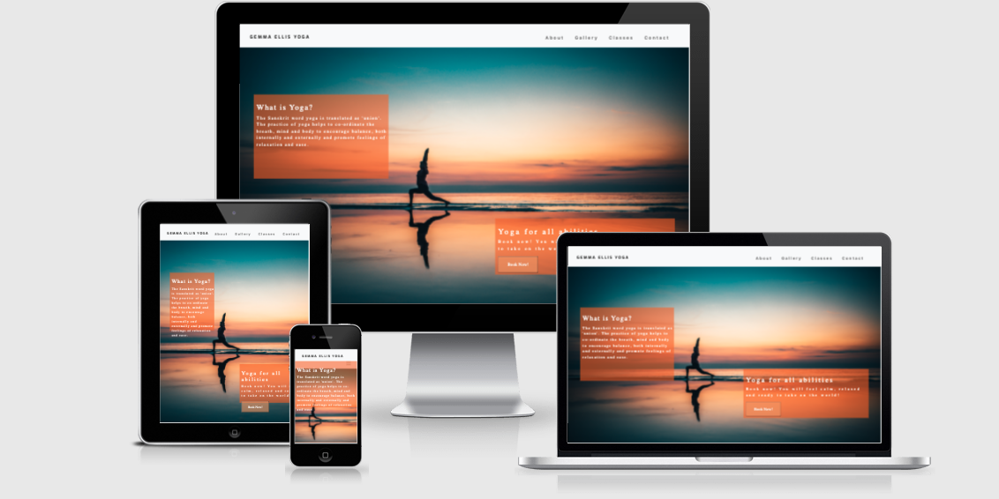

# **Gemma Ellis Yoga**

View the live project [here](https://gemmaellis16.github.io/yoga-project/)

## **Project Aim**

Welcome to Gemma Ellis Yoga website. This yoga studio is located in the heart of a valley in North Wales and a perfect location to feel the benefits of what yoga has to offer - a beautiful stretch, some lovely breathing techniques and a peaceful relaxation to finish. On this site I hope you will be able to easily navigate the information about the studio and teacher and also able to access it on mobile, tablet and desktop.

## **Table of Contents**

* [User Experience (UX)](#user-experience)
    * [User Goals](#user-goals)
    * [Owner Goals](#owner-goals)
    * [User Stories](#user-stories)
* [Design](#design)
    * [Colour Scheme](#color-scheme)
    * [Typography](#typography)
    * [Imagery](#imagery)
* [Wireframes](#wireframes)
* [Technologies Used](#technologies-used)
    * [Languages Used](#language-used)
    * [Frameworks, Libraries and Programmes used](#frameworks,-libraries-and-programmes-used)
* [Testing](#testing)
    * [Testing User Stories from User Experience](#testing-user-stories-from-user-experience)
    * [Existing Features](#existing-features)
    * [Navigation](#navigation)
    * [Main Image](#main-image)
    * [Cover Text](#cover-text)
    * [Benefits](#benefits)
    * [Testimonials](#testimonials)
    * [About Section](#about-section)
    * [Gallery](#gallery)
    * [Classes](#classes)
    * [Contact](#contact)
    * [Features to be implemented](#features-to-be-implemented)
* [Further Testing](#further-testing)
    * [Navigation](#navigation)
    * [Known Bugs](#known-bugs)
    * [Note about Commits](#note-about-commits)
* [Deployment](#deployment)
    * [Github Pages](#github-pages)
    * [Forking Github Repository](#forking-github-repository)
    * [Making a Local Clone](#making-a-local-clone)
* [Credits](#credits)
    * [Code](#code)
    * [Content](#content)
    * [Media](#media)
    * [Acknowledgments](#acknowledgments)

## **User Experience (UX)**

### **User Goals**

1. The website should have valuable information on yoga and the studio.
1. The website should be easy to use on mobile, tablet and desktop.
1. It should be visually appealing with images and colours.
1. It should have an about page detailing yoga etiquette and the yoga teachers.
1. The website should have testimonials about the teacher and studio.
1. It should have contact details that are easy to navigate. 
1. It should have booking option on the main page to capture the users attention.
1. It should have a form to contact the studio directly.

### **Owner Goals**

 1. Advertise the studio.
 1. Give information on yoga (and the teacher)
 1. Increase bookings and interest in the studio.

### **User Stories**

  * First Time Visitor Goals

 1. As a first time visitor, I want to understand the main purpose of the site and learn about the yoga studio.

 1. As a first time visitor, I want to be able to navigate throughout the site to find content.

 1. As a first time visitor, I want to look at testimonials to understand what yoga students think of the studio and teacher and see if they are trusted and also want to locate their social media accounts for more information (this will just be the main social media accounts for privacy reasons).

 1. As a first time visitor, I want to know what yoga is and it's benefits.

 1. As a first time visitor, I want to know the location of the studio.

 1. As a first time visitor, I want to know the price of the class.

 * Returning Visitor Goals

 1. As a returning visitor, I want to find the best way to get in contact with the studio with questions that I may have.

 1. As a returning visitor, I want to know the membership options.

 1. As a returning visitor, I want to look at the timetable for classes.
 

 * Frequent Visitor Goals

 1. As a frequent visitor, I want to check the timetable for updated times, days and classes.

[Back to top](#table-of-contents)

### **Design**

#### * **Colour Scheme**

 * The main colour is a pink/peach colour (rgba(235, 131, 46, 0.548)) for the background, footer is rgba(236, 151, 93, 0.6), tables and text boxes are rgba(245, 94, 24, 0.582).
 The idea is that the colours compliment the main image on the homepage to give the user a feeling of warmth and a relaxed feel typically like you would feel in a yoga class.
    

#### * **Typography**

* The Roboto font is the main font used throughout the website with Exo as the fallback font in case the font isn't imported correctly to the site. The Roboto font is used frequently in programming.

#### * **Imagery**

* The large yoga image on the homepage is designed to be calming to give the users the sense that when they attend the studio they will feel relaxed and ultimately want to browse the website further to book a class.

[Back to top](#table-of-contents)

### * **Wireframes**

* Desktop wireframe - [view](wireframes/yoga-desktop.bmpr)[here](https://github.com/gemmaellis16/yoga-project/blob/main/wireframes/yoga-desktop.bmpr)

* Tablet wireframe - [view](wireframes/yoga-tablet.bmpr)[here](https://github.com/gemmaellis16/yoga-project/blob/main/wireframes/yoga-tablet.bmpr)

* Mobile wireframe - [view](wireframes/yoga-mobile.bmpr)[here](https://github.com/gemmaellis16/yoga-project/blob/main/wireframes/yoga-mobile.bmpr)

[Back to top](#table-of-contents)

### **Technologies Used**

### **Language Used**

* [HTML](https://en.wikipedia.org/wiki/HTML5)

* [CSS](https://en.wikipedia.org/wiki/CSS)

### **Framework, Libraries & Programmes Used** 

1. [Bootstrap 4.5](https://getbootstrap.com/docs/4.5/getting-started/introduction/)
    * Bootstrap was used to assist with resposiveness and styling of the website

1. [Hover.CSS](https://ianlunn.github.io/Hover/)
    * Hover.css was used on the Social Media icons in the footer to add the float transition while being hovered over.

1. [Google Fonts](https://fonts.google.com/)
    * Google fonts were used to import the 'Roboto' font into the style.css file which is used on all pages throughout the project.

1. [Font Awesome](https://fontawesome.com/)
    * Font Awesome was used throughout the website to add icons to appeal to the eye.

1. [Git](https://git-scm.com/) 
    * Git was used for version control by utilizing the Gitpod terminal to commit to Git and Push to GitHub.

1. [Github](https://github.com/)
    * GitHub is used to store the projects code after being pushed from Git.

1. [Balsamiq](https://balsamiq.com/)
    * Balsamiq was used to create the wireframes during design ideas.

[Back to top](#framework-libraries-&-programmes-used)

### **Testing**

The W3C Markup Validator and W3C CSS Validator were used to validate every page of the project to ensure there were no errors in the code. 

* [W3C Markup Validator](https://validator.w3.org/#validate_by_input) - [Index](validator/index.pdf) [About](validator/about.pdf) [Classes](validator/classes.pdf) [Gallery](validator/gallery.pdf) [Contact](validator/contact.pdf)

* [W3C CSS Validator](https://jigsaw.w3.org/css-validator/) - [Results](validator/css.pdf)

#### **Testing User Stories from User Experience**

* **First Time Visitor Goals**

1. As a first time visitor, I want to easily understand the main purpose of the site and learn more about the studio.

    - When entering the site users will see a readible [navigation bar](screenshots/navigation.png) to get to the page of their choice. Even when they are on a specific page they can press the 'Gemma Ellis Yoga' logo to return to the main page.

    - On the contact us page you must input your details or the form will ask for it and you will be unable to submit the [form.](screenshots/form-input.png)

    - On the about page I want to clearly locate the [New student registration form](screenshots/student-reg.png) to fill it out and bring with me to the first session. 

1. As a first time visitor, I am curious to know more about the owner/studio

    - On the homepage users can scroll down and see student [testimonials](screenshots/testimonials.png) and be clear that the studio is a friendly environment with a good teacher.

    - Clearly labelled 'About' page on navigation bar.

    - The [About](screenshots/about.png) page contains a photo of the teacher and short paragraph about her experience.  

1. As a first time visitor, I want to view the studio and student/teachers [gallery](screenshots/gallery.png) to view the environment so I can decide if it's the class I'd like to participate in. 

    - In the navigation bar there is a clearly labelled 'Gallery' page with images of inside the studio, with students and outside of the studio. 

1. As a first time visitor, I want to know what yoga is and what are it's [benefits](screenshots/benfits.png).

* **Returning Visitor Goals**

1. As a returning visitor, I want to find the best way to get into [contact](screenshots/contact.png) with the studio with any questions I may have. 

    - The navigation bar clearly highlights the 'Contact page'.

    - Here, they can fill out the form on the page (but I have not linked it to anything as this out of the scope of the MS1 project).

    - There is also the direct [phone number or email](screenshots/location.png) of the studio (fictional).

    - The [footer](screenshots/footer.png) contains links to Facebook, Twitter and Instagram (to the main pages of the social media homepages and not to the teachers own account due to privacy purposes).

1. As a returning visitor, I want to find out the [membership](screenshots/prices.png) options

    - In the classes page [prices](screenshots/prices.png) are clearly labelled for the visitor to view.

1. As a returning visitor, I want to find out what days and times the [yoga](screenshots/timetable.png) sessions are on.

[Back to top](#table-of-contents)

## **Features**

 * Responsive on all device sizes.

 * Interactive elements.

### **Existing Features**

### **Navigation**

For the navigation bar I have used Boostrap to create a responsive navbar as well as the hamburger icon for mobile devices to be more user-friendly. 

### **Main Image**

The main image is of a yoga pose on the beach during sunset from the website unsplash. It creates a warm, calming feeling. The yoga pose is a simple pose that all abilities can perfrom so wouldn't put off any beginners or unconfident students.

### **Cover Text**

The main idea to put cover text over the image was to grab the user attention immediately - one box is to get them to book a session straight away or to have that in thier minds immediately and the second box is to explain the definition of yoga so that a beginner understands the purpose.

### **Benefits**

This idea was taken from the Love Running project - as its simple and eye catching for the user - with short explanations of what the benefits of yoga are to a beginner or even to remind the experienced yoga students. It is in three columns (taken from Bootstrap) to appear neat and tidy on the page with easily identifiable Font awesome icons to attract the user. 

### **Testimonials**

I also used  the grid from bootstrap and as also some icons to make the section more visually appealing with images from my own collection and different names for the people in the images (I have consent of these people).

### **About Section**

I used an example layout from W3 website to create the about section to introduce the user to the teacher. With the same image layout that was used in the testimonials section for consistency over the pages.

I added an information/etiquette/tips section because as a new student to yoga they may feel uncomfortable entering a studio without any prior knowledeg of what to bring and of what to expect ect so this may help those that are unconfident accessing the studio alone. 

In addition I added two downloadable links on this page, one of a sample relaxation script which had audio and the second of a student registration form that would be required upon visiting the studio for the first time. Again I added fontawesome icons to the headers to be more appealing.

### **Gallery**

I wanted three columns and three rows of images so it would be appealing to the eye on desktop view and then down to two columns in mobile view so that images didn't appear stretched or pixlated. I did originally put in the wireframes that I wanted one column in the mobile view but this wouldn't appear balanced in my opinion. I also added an extra image to appear in mobile view so that there would be 10 images (5 in each column) to appear balanced (balance is at the heart of yoga so I wanted the website to appear balanced as much as possible throughout).

### **Classes**

This is the most simple page of them all - with three simple tables to look at the class timetable, simple descriptions of the classes and then the price options. It is important to have different price options as this may attract more students. 

### **Contact**

At the top of the page I placed the form so that it would catch the attention of the users if they had any questions for the teacher. They then have to scroll down for the contact details and the map of the location. 

[Back to top](#table-of-contents)

### **Features to be implemented**

* When submitting the form, the information should be sent to the yoga studio email account.
* Chat bot that can assist the user.
* Interactive map for the location with a link to google maps.
* Include information on how their data will be used (GDPR-Law).
* Yoga videos for those that can not attend class.  

### **Further Testing**

* The website was tested on Google Chrome and Safari browsers.

* The website was viewed on a variety of devices such as desktop, laptop, tablet and iphone. 

* A large amount of testing was conducted to ensure that all pages were linking correctly.

* Friends were asked to review the site and content to point out any bugs/user experience.

[Back to top](#table-of-contents)

#### * **[Navigation bar](screenshots/navbar-image.png)**

* Idea
I wanted to ensure that the navigation bar was working accordingly at the top of the page and when clicked on, the navigation links would take the user to the page of their choice. For simple and attractive purposes the navigation bar would then convert to a hamburger icon with a dropdown menu on mobile devices.

* Utilization
I implemented the navigation bar using Bootstrap, which ensured an effective overall structure and lay out to the navbar. CSS was used to overwrite the default settings and made the navbar in line with the overall webite. I also used Bootstrap to implement the hamburger sign for mobile devices.

* Test
To test the navigation bar, I clicked all the links to make sure it worked properly. I have also opened the website in various browers (safari, google chrome, mozilla firefox) to make sure it worked on all browsers and devices. On mobile the navigation transformed into the hamburger sign with a dropdown menu.

* Result
The navigation bar appears how I would have expected it on all browsers and devices. However on the index page (main page) while on mobile device the dropdown does not appear as it is as it's blurred by the text-cover box. - So I have to hide the cover box in mobile display in order to see the dropdown menu.

* Verdict
The test has passed all the criteria and works like planned.

### [Modal](screenshots/modal-image.png)
* Idea
I wanted to use a modal that would allow the user to book on the main page (a place were it's clearly visible and easy to get to for a returning user).

* Utilisation
I used Bootstrap to include the modals on the website and this was positioned to the left of the box as the text was also aligned left. I used the same colours as I did on my contact us form to keep consistency throughout the pages. 

* Test
Initially the modal worked succesfully however the next day it didn't work. So every effort was used to check the problem. I realised I had deleted a bootstrap link (because I had )

* Result
The modal opened up when the Book now button was clicked and appeared on screen.

* Verdict
The modal works as planned.

### [Audio](screenshots/audio-image.png)

* Idea
I wanted to use audio as a taster for users of what to expect when in the relaxation during a class. This would allow the user to determine if they would like to hear more by coming to a session.  

* Utilisation
I used an iphone recording device called 'voice memos' to record the audio and used one of the relaxation scripts I used during my classses in the past. To ensure they didn't miss this it was in the about section (to learn more about the classes) and I provided a clear download icon so that the user would know where to click.

* Test
The audio worked succesfully on the first test.

* Result
The audio opened up when the Download button was clicked and appeared on screen.

* Verdict
The audio works as planned.

### [Student Registration Form](screenshots/student-form.png)

* Idea
I wanted to enable the users to download and fill in the student registration form (if they would prefer) before the session so there is no rush at the beginning of the session. This is important for the teacher to have as it gives the teacher an idea of any health issues so that the teacher would be able to adapt the sessions/poses for the individual. 

* Utilisation
I copied a student reg template I used in the past to a folder and again to keep it consistent with the audio link put a download icon next to it so that they could download the page. 

* Test
The file worked succesfully on the first test, 

* Result
The audio opened up when the Download button was clicked and appeared on screen.

* Verdict
The audio works as planned.

### [Contact Form](screenshots/form-image)

* Idea
I want to include a contact form so that the user can contact the studio/teacher with any queries they have (even to book through this too). On the form they can enter their name, email address and write a message. I also ensured they had to fill in the fields before submitting the button. 

* Utilization
To create this, I made a contact page and placed the form at the top of the page. There were two fields for the name and email address then a textarea field for the message and a submit button. I also ensured the form was the same colour as the rest of the pages for consistency.

* Test
When I tested the form, I realised that nothing opened up and there was nothing to indicate to the user that the form was submitted. This meant it was not user friendly, so if I had more experience I would have liked to include JS to implement this.

* Result
The form works but after filling it in all the content dissappears so the user is left if the message was sent.

* Verdict
The form worked but without feedback it is not user friendly.

[Back to top](#table-of-contents)

### **Known Bugs**

* On some mobile devices......
* On some internet browsers .......

### **Note about Commits**

* IMPORTANT - Previous commits have been wiped due to problems with Gitpod on 29/7/21, fortunately I was able to recover some of my work and create a new workspace.

[Back to top](#table-of-contents)

## **Deployment** 

#### * **Git hub pages**

The project was deployed to Github pages using the following steps:

    1. Log in to [GitHub](https://github.com/) and locate the GitHub Repository.
    * At the top of the Repository, locate the "Settings" button on the menu.
    * Scroll down to the settings page and locate the "GitHub Pages" section.
    * Under the "Source" button, click the dropdown "None" and choose "Master Branch".
    * Scroll back down to locate the published site [link](https://github.com/) in the "GitHub Pages" section.

[Back to top](#table-of-contents)

#### * **Forking Github Repository**

Forking means to make a copy of the original document so that you can view/edit without it altering the original repository. It can be forked using the following steps:

    1 Log in to GitHub and locate the [GitHub Repository](https://github.com/)
    1 At the top of the Repository just above the "Settings" button, press the "Fork" button.
    1 Resulting in a copy of the original repository in your GitHub account.

#### * **Making a Clone**

Cloning means creating a local copy of the remote repository. This allows you to make edits locally rather than directly in the source files. It can be cloned using the following steps:

    1. Log in to GitHub and find the [GitHub Repository](https://github.com/)
    1. Under the repository name, click "Clone or download".
    1. To clone the repository using HTTPS, under "Clone with HTTPS", copy the link.
    1. Open Git Bash
    1. Change the working directory to the area where you want the clone to be made to.
    1. Type git clone, and then paste the URL you copied in Step 3.

[Back to top](#table-of-contents)

## **Credits**

### **Code**

* The full screen image came from [unsplash](https://unsplash.com/photos/UvWx67Ivqe00 

* [Bootstrap v4.5](https://getbootstrap.com/docs/4.5/getting-started/introduction/) Bootstrap library used throughout the project to make the site responsive to the Bootstrap grid system.

* The testimonials idea was taken from the quotes section in the[Whiskey project](https://learn.codeinstitute.net/courses/course-v1:codeinstitute+FE+2017_T3/courseware/a4b90d17e5c94220a0f83f00ce7fa606/2aca2c94a518427495cc1b4bc641ccbf/)

* The footer idea was taken from the [Coffeehouse project](https://learn.codeinstitute.net/courses/course-v1:CodeInstitute+CSE101+2020_Q2/courseware/d6dd40a51a9543e78b59924c739abff5/2f123befba874366823427fa9f2a2262/2?activate_block_id=block-v1%3ACodeInstitute%2BCSE101%2B2020_Q2%2Btype%40vertical%2Bblock%40da616ef1efe748bd84d36aa804ffead9)

* The main image code was taken from the [Love Runnig project](https://learn.codeinstitute.net/courses/course-v1:CodeInstitute+CSE101+2020_Q2/courseware/be0e510a3aca4bccb6e0bba4cf7cf06b/83c6c94d55f44c79a3646810d80ce7a3/)
* The cover text was sourced from the [Love Running project](https://learn.codeinstitute.net/courses/course-v1:CodeInstitute+CSE101+2020_Q2/courseware/be0e510a3aca4bccb6e0bba4cf7cf06b/83c6c94d55f44c79a3646810d80ce7a3/)
* The benefits section was sourced and edited from the [Love Running Project](https://learn.codeinstitute.net/courses/course-v1:CodeInstitute+CSE101+2020_Q2/courseware/be0e510a3aca4bccb6e0bba4cf7cf06b/6eb8cfc87bfd434a87861a844e00b655/)
* The gallery idea was sourced from the [Love Running project](https://learn.codeinstitute.net/courses/course-v1:CodeInstitute+CSE101+2020_Q2/courseware/be0e510a3aca4bccb6e0bba4cf7cf06b/0b88201f299f4e059c23977b8e25f27a/)
* The contact us form was sourced from the [Love Running project](https://learn.codeinstitute.net/courses/course-v1:CodeInstitute+CSE101+2020_Q2/courseware/be0e510a3aca4bccb6e0bba4cf7cf06b/d533998456514d97a88ce691537e00a6/)

* The download now idea on the about page was taken from the [Resume project](https://learn.codeinstitute.net/courses/course-v1:codeinstitute+FE+2017_T3/courseware/616289d66b5641a3808cc43e53842695/e1da3f354d874bbb8dbc996d658a66e8/)

* I used the table content code from [W3schools](https://www.w3schools.com/howto/howto_css_about_page.asp/) for my about page. 
* I used the table structure on my classes pages from [W3schools](https://www.w3schools.com/html/html_tables.asp)

* I used a modal template for the book here button on my homepage from [Bootstrap](https://getbootstrap.com/docs/5.1/components/modal/)

* I used [Bootstrap](https://getbootstrap.com/docs/4.5/components/navbar/) template or the navigation bar.

[Back to top](#table-of-contents)

### **Content**

* Content was written by me, the developer - this is the content I created on my yoga flyer while studying to be a yoga teacher in 2016. 

### **Media** 

* All gallery images created by the developer - they are photos from a yoga studio I attended as part of my yoga teacher training in Spain. So the studio does not exist in North Wales (like I have stated but merely a fictional studio in Betws y Coed). The testimonial images have also been created by me. 

* But as noted previously the main image is sourced from [unsplash](https://unsplash.com/photos/UvWx67Ivqe0).
* The map on the contact page was sourced from [Google](https://www.google.co.uk/maps/place/Betws-y-Coed/@53.0910704,-3.8119933,15z/data=!3m1!4b1!4m5!3m4!1s0x48651463227a6575:0x2afbefd48524751d!8m2!3d53.0930858!4d-3.8010354?hl=en)

### **Aknowledgments** 

* Tutors at Code Institute for their support especially Sean and Igor they really helped when I was feeling that I was unable to grasp all the styling issues.

[Back to top](#table-of-contents)

